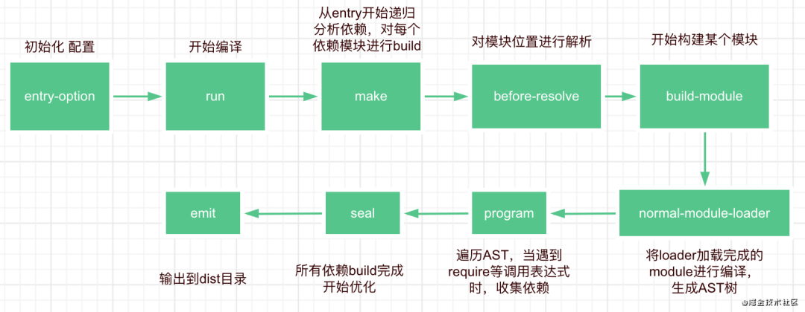

# webpack之原理分析
webpack本质：理解为是一种基于事件流的编程范例，一系列的插件运行

## 命令行
- 通过npm script 运行webpack
   - 开发环境： npm run dev
   - 生产环境： npm run build
- 通过webpack直接运行
    - webpack entry.js  bundle.js

## 这个过程发生了什么
运行命令后 npm让命令行工具进入node_modules/.bin目录查找是否存在webpack.sh或者webpack.cmd文件 如果存在，则执行，不存在，抛出错误（node_modules/webpack/bin/webpack.js）

启动后的结果： webpack最终找到webpack-cli(webpack-command）包，并且执行cli

```js
//正常执行返回
process.exitCode = 0; 
// 运行某个命令
const runCommand = (command, args) => {
  const cp = require("child_process");
  return new Promise((resolve, reject) => {
        const executedCommand = cp.spawn(command, args, {});
        executedCommand.on("error", error => reject(error););
    // code 为 0 则说明成功，resolve，否则reject
        executedCommand.on("exit", code => {})
    });
} 

// 判断某个包是否安装
const isInstalled = packageName => {
    try {
        require.resolve(packageName);
        return true;
    } catch (err) {
        return false;
    }
}


// webpack 可用的cli： webpack-cli 和webpack-command
const installedClis = CLIs.filter(cli => cli.installed)

//  判断两个cli是否安装
if (!installedClis.length) {
    // Todo
} else if (installedClis.length === 1) {
    //Todo
} else {
    // Todo
}
```
### webpack-cli

- 引入yargs， 对命令行进行定制
- 分析命令行参数， 对各个参数进行转换，组成编译配置项
- 引用webpack，根据配置项进行编译和构建

```js
// wepback-cli处理不需要经过编译的命令
const NON_COMPILATION_ARGS = [
    "init", // 创建一份webpack配置文件
    "migrate", // 进行webpack版本迁移
    "add", // 往webpack配置文件中增加属性
    "remove", // 从webpack配置文件中删除属性
    "serve", // 运行webpack-serve
    "generate-loader", // 生成webpack loader 代码
    "generate-plugin", //  生成webpack plugins 代码
    "info" // 返回与本地环境相关的一些信息
];

const NON_COMPILATION_CMD = process.argv.find(arg => {
    if (arg === "serve") {
        global.process.argv = global.process.argv.filter(a => a !== "serve");
        process.argv = global.process.argv;
    }
    return NON_COMPILATION_ARGS.find(a => a === arg)

}) 

if(NON_COMPILATION_CMD) {
    return require("./prompt-command")(NON_COMPILATION_CMD, ...process.argv);
}

// 通过yargs，提供命令和分组参数，动态生成help帮助信息
const yargs = require("yargs").usage(`webpack-cli ${
    require("../package.json").version
}

// 将输入的命令传递给config-yargs
require("./config-yargs")(yargs);
// 对命令行参数进行解析
yargs.parse(process.argv.slice(2), (err, argv, output) => {}
// 生成 options webpack参数配置对象
let options = require("./convert-argv")(argv);
// 将参数设置对象交给webpack执行
let compiler = webpack(options);

```
- webpack-cli 使用 args 分析，参数分组，将命令划分为9类：
    -   Config options: 配置相关参数（文件名称、运行环境）
    -   Basic options: 基础参数（entry、debug、watch、devtool）
    -   Module options: 模块参数，给loader设置扩展
    -    Output options: 输出参数（输出路径、输出文件名称）
    -   Advanced options: 高级用法（记录设置、缓存设置、监听频率、bail等）
    -    Resolving options: 解析参数（alias和解析的文件后缀设置）
    -    Optimizing options: 优化参数
    -    Stats options: 统计参数
    -    options: 通用参数（帮助命令、版本信息）
- webpack-cli执行结果:
    - webpack-cli对配置文件和命令行参数进行转换最终生成配置选项参数options，最终会根据配置参数实例花webpack对象，然后交给webpack执行构建流程(complier)

### Tapable插件架构和Hooks设计

- compiler extends Tapable -> compilation extends Tapable
- Tapable 是一个类似Nodejs的EventEmitter 的事件库，主要控制钩子函数的发布与订阅，控制着webpack插件系统， Tapable暴露了很多Hook（钩子）类，为插件提供挂载的钩子

    - SyncHook： 同步钩子
    - SyncBailHook：同步熔断钩子
    - SyncWaterfallHook： 同步流水钩子
    - SyncLoopHook: 同步循环钩子
    -   AsyncParallelHook: 异步并发钩子
    -   AsyncParallelBailHook: 异步并发熔断钩子
    -   AsyncSeriesHook: 异步串行钩子
    -   AsyncSeriesBailHook: 异步串行熔断钩子
    -   AsyncSeriesWaterfallHook: 异步穿行流水钩子

- Tapable Hooks 类型：
    - Hook：所有钩子的后缀
    -   Waterfall：同步方法，但是它会传值给下一个汉顺
    -   Bail：熔断：当函数有任何返回值，就会在当前执行函数停止
    -   Loop：监听函数返回true表示继续循环，返回undefined表示结束循环
    -   Sync：同步方案
    -   AsyncSeries：异步串行钩子
    -   AsyncParallel：异步并发执行钩子

- Tapable暴露出来的都是类方法， new一个类方法获得我们需要的钩子
    
    - 异步：callAsync/promise
    - 同步：call
    - 异步：tapAsync/tabPromise/tap
    - 同步：tap
    + class接受数组参数options，非必传，类方法会根据传参，接受同样数量的参数
    +  绑定/订阅：
    +  执行/发布：

```js
        // 创建钩子
    const hook = new SyncHook(['arg1', 'arg2', 'arg3'])
    // 绑定事件到webpack事件流
    hook.tap('hook1', (arg1, arg2, arg3) => {console.log(arg1, arg2, arg3)})
    // 执行
    hook.call(1, 2, 3);// 1, 2, 3
```

## Tapable 与webpack联系起来

```js

if (Array.isArray(options)) {
        compiler = new MultiCompiler(options.map(options => webpack(options)));
    } else if (typeof options === "object") {
        options = new WebpackOptionsDefaulter().process(options);
        compiler = new Compiler(options.context);
        compiler.options = options;
        new NodeEnvironmentPlugin().apply(compiler);
        if (options.plugins && Array.isArray(options.plugins)) {
            for (const plugin of options.plugins) {
                plugin.apply(compiler);
            }
        }
        compiler.hooks.environment.call(); // hook了
        compiler.hooks.afterEnvironment.call();
        compiler.options = new WebpackOptionsApply().process(options, compiler);
    } else {
        throw new Error("Invalid argument: options");
    }
    if (callback) {
        // ....
        compiler.run(callback);
    }
    return compiler;
};

```

## webpack 整体运行流程
#### 流程图
 


